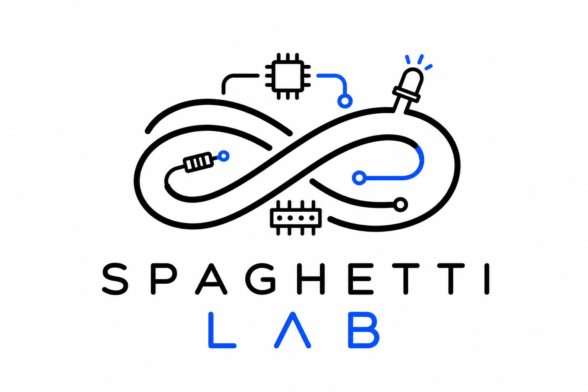

  

From prototype to product.

SpaghettiLAB is an open ecosystem of stackable hardware modules, firmware, and software designed to accelerate embedded and IoT development.

## Repository Structure

- Hardware
- Firmware
- Software
- Documentation

## Citation

If you use SpaghettiLAB in research, publications,
articles, videos, blog posts, educational material,
or derivative projects, please cite:

> Piccini, A. (2026).
> SpaghettiLAB: Modular Stackable Electronics Platform.
> GitHub Repository.
> https://github.com/andreapiccini/SpaghettiLAB

A machine-readable citation file is available in `CITATION.cff`.

## Licensing

SpaghettiLAB uses multiple licenses:

| Content | License |
|----------|----------|
| Software & Firmware | Apache 2.0 |
| Hardware Designs | CERN-OHL-S-2.0 |
| Documentation | CC BY 4.0 |

See the LICENSE files in each directory.
