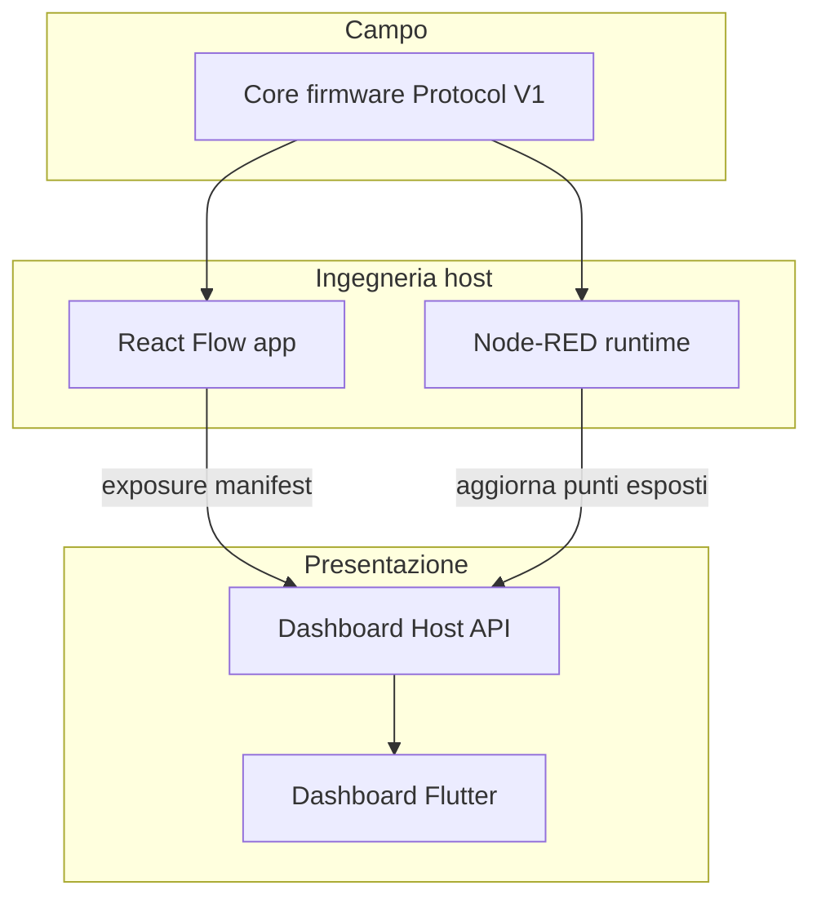

# SpaghettiLAB Software — Indice master e revisione globale

Documento di **ingresso unico** per capire cosa vogliamo costruire, dove sta
documentato ogni pezzo, e **quali task mancano** da implementare. Aggiornare questo
file quando una roadmap cambia stato o ne nasce una nuova.

[README](README.md) ·
[Firmware / Protocol V1](../Firmware/core/PROTOCOL_V1.md) ·
[Platform report](../Firmware/core/verification/v1/PLATFORM_REPORT.md)

---

## 1. Per chi legge (in 2 minuti)

SpaghettiLAB Software è una **catena di prodotti** che va dall’ingegneria del
dispositivo all’interfaccia che l’utente finale vede:

```text
Firmware (Core)          → acquisizione, processing bounded, Protocol V1
React Flow (host)        → ingegneria: moduli, Config, profili, deploy
Node-RED (host)          → automazioni, Telegram, integrazioni always-on
Dashboard Host (edge/cloud) → exposure, auth, appearance, audit
Dashboard Flutter        → presentazione grafica personalizzabile (prodotto visibile)
```

**Cosa vendiamo:**

| Modello | Cliente | Cosa ottiene |
|---|---|---|
| **Ecosistema** | Progettista / integratore | Tool per configurare e collegare tutto |
| **Turnkey (Site Package)** | Azienda / operatore finale | Stack on-prem già configurato + dashboard + ruoli — **zero implementazione** |

**Regola d’oro:** la dashboard **mostra** e **personalizza**; **non automatizza**
(regole in Node-RED/Config) e **non ingegnerizza** (React Flow).

---

## 2. Visione prodotto (dettaglio)

### 2.1 React Flow — ingegneria

- Vicino all’hardware: composizione fisica, processing graph, Device Profile, deploy Config.
- Tre grafi separati: Physical, Device Processing, System Automation (→ Node-RED).
- Utente: tecnico, progettista, partner che conosce il catalogo firmware.

### 2.2 Node-RED — automazioni e integrazioni

- Esempio: inviare temperatura su Telegram; se reply → accendi pompa.
- Runtime always-on sul server del cliente (o edge).
- La dashboard **non** contiene editor Node-RED; al massimo link per ruoli autorizzati.

### 2.3 Dashboard — presentazione (focus commerciale)

- Motore **grafico**: widget live, animazioni (pompa che gira), temi, sfondi, brand.
- **View modes** estendibili: cards, schema macchina, pianta dall’alto, first person
  stilizzato — via **Visual Pack** (marketplace o developer).
- **Non** Arduino Cloud: layout e look liberi, pack scaricabili o creati da chi programma.
- Legge solo **ExposurePoint** (segnali già esposti dall’host), mai catalogo grezzo MQTT.

### 2.4 Deployment, ruoli, assistenza remota

- Site on-prem: Docker (host + Node-RED + broker opzionale).
- Ruoli: viewer, operator, site_admin, technician, integrator, partner_*, spaghetti_support.
- Accesso SpaghettiLAB al cliente: **Support Grant** approvato, a tempo, auditato — mai backdoor.

Doc: [`DEPLOYMENT_ACCESS_MODEL.md`](DEPLOYMENT_ACCESS_MODEL.md)

---

## 3. Catena e confini (cosa non mischiare)



| Domanda | Dove va |
|---|---|
| Kalman sul giroscopio? | React Flow → Config firmware |
| Regola Telegram → pompa? | Node-RED |
| Pompa animata in UI? | Dashboard (legge `visualState` esposto) |
| Chi può accedere in remoto? | Host — Support Grant |
| API dashboard nel firmware? | **No** |

---

## 4. Componenti Software (cartelle)

| Cartella | Ruolo | Doc principale |
|---|---|---|
| [`micro-flow-editor/`](micro-flow-editor/) | App React Flow + packages dominio/SDK | [REACT_FLOW_ARCHITECTURE.md](REACT_FLOW_ARCHITECTURE.md) |
| [`node-red/`](node-red/) | Node-RED Docker locale + doc gateway | [node-red/README.md](node-red/README.md) |
| [`dashboard/`](dashboard/) | App Flutter + design + HOST_API | [dashboard/DASHBOARD_ARCHITECTURE.md](dashboard/DASHBOARD_ARCHITECTURE.md) |
| [`ux/screens/`](ux/screens/) | Spec UX React Flow (3 file/schermata) | [UX_ARCHITECTURE.md](UX_ARCHITECTURE.md) |
| [`dashboard/ux/`](dashboard/ux/) | Spec UX Dashboard (fase 1, da scrivere) | [dashboard/ux/README.md](dashboard/ux/README.md) |

**Dashboard Host** (servizio edge/cloud) — contratto in [`dashboard/HOST_API.md`](dashboard/HOST_API.md);
implementazione runtime = task D120+ / E020+, non ancora codice dedicato in repo.

---

## 5. Roadmap — panoramica stato

Legenda: ✅ fatto · ⬜ da fare · 📄 solo documentazione

### 5.1 React Flow backend (`roadmap/react-flow-v1/`)

| Area | Done | Open | Gate |
|---|---:|---:|---|
| S010–S080 core pipeline | 18 | 0 | — |
| S090 runtime | 1 | 3 | S092–S094 |
| S100 OTA | 0 | 4 | S101–S104 |
| S110 Node-RED integration | 0 | 3 | S111–S113 |
| S120 security | 3 | 1 | S124 |
| Chiusura | 0 | 1 | **S130** |

**Task ancora ⬜ (implementazione):**

`S092` · `S093` · `S094` · `S101` · `S102` · `S103` · `S111` · `S112` · `S113` · `S124` · `S130`

Dettaglio: [roadmap/react-flow-v1/README.md](roadmap/react-flow-v1/README.md)

### 5.2 UX React Flow (`roadmap/ux-v1/`)

| Stato | Note |
|---|---|
| ✅ **Completa (doc)** | 11 schermate + cross-cut UX-S125 (modalità base/avanzata, default `base`) |

Dettaglio: [roadmap/ux-v1/README.md](roadmap/ux-v1/README.md)

### 5.2b UI React Flow (`roadmap/app-v1/`)

Implementazione in `micro-flow-editor/packages/app`. Schermate S010–S080 ✅;
S090–S120 ⬜; cross-cut [UI-S125](roadmap/app-v1/tasks/UI-S125-simple-advanced-mode.md)
(modalità base/avanzata, persistenza `localStorage`, default `base`) ✅.

Dettaglio: [roadmap/app-v1/README.md](roadmap/app-v1/README.md)

### 5.3 Dashboard fase 1 (`dashboard/roadmap/dashboard-v1/`)

| Area | Done | Open |
|---|---:|---:|
| Documentazione + HOST_API V1 | ✅ D010–D070 | — |
| Implementazione codice | ✅ D011–D051 | — |
| Gate | ✅ D080 2026-08-16 | fase 2 D200+ |

**Fase 1 chiusa il 2026-08-16.** Next grafica: D200–D250.

Dettaglio: [dashboard/roadmap/dashboard-v1/README.md](dashboard/roadmap/dashboard-v1/README.md)

### 5.4 Ecosystem access & turnkey (`roadmap/ecosystem-access-v1/`)

| Area | Done | Open |
|---|---:|---:|
| Modello formale | ✅ E010 | — |
| Identity / RBAC | ✅ E020 · E021 · E050 | E051 |
| Implementazione | 3 | **6 task** |

**Task ancora ⬜:** `E070` · `E071` · `E051` · `E060` · `E080` · `E081` · `E090`

Dettaglio: [roadmap/ecosystem-access-v1/README.md](roadmap/ecosystem-access-v1/README.md)

### 5.5 Dashboard fase 2 (`dashboard/roadmap/dashboard-v2/`)

| ID | Tema | Stato |
|---|---|---|
| D200 | Scene + editor placement 2D | ✅ |
| D210 | Renderer schematic | ✅ |
| D220 | Renderer top_down | ✅ |
| D230 | first_person | ✅ (ritirato dal prodotto) |
| D240 | SDK pack locale | ✅ |
| D250 | marketplace reale + firma | ✅ |
| D110 | Adapter Protocol V1 | ✅ |
| D120 | EdgeHost MQTT | ✅ |
| D130 | CloudHost HOST_API | ✅ |

---

## 6. Elenco task mancanti (checklist revisione)

Usare questa sezione in **revisione finale**: spuntare quando implementato + verificato.

### 6.1 React Flow — backend

- [ ] S092 — Command runner e discovery
- [ ] S093 — Stato, health e resource monitor
- [ ] S094 — Operazioni amministrative autorizzate
- [ ] S101 — Marketplace capability e dependency resolver
- [ ] S102 — OTA preflight e budget risorse
- [ ] S103 — OTA state machine e audit
- [ ] S111 — System Automation Graph
- [ ] S112 — Package nodi Node-RED SpaghettiLAB
- [ ] S113 — Compiler/deploy Node-RED
- [ ] S124 — Conferme distruttive e recovery threat test
- [ ] S130 — **Gate chiusura React Flow V1 end-to-end**

### 6.2 Dashboard — fase 1 (UI + fake host)

- [x] D010 — Approvazione architettura e confini
- [x] D011 — Flutter scaffold + Docker/FVM + CI
- [x] D020 — Convenzione spec UX (9 schermate)
- [x] D021 — Spec connect
- [x] D022 — Spec overview
- [x] D023 — Spec canvas cards + animazioni
- [x] D024 — Spec widget picker
- [x] D025 — Spec point detail
- [x] D026 — Spec appearance
- [x] D029 — Spec marketplace shell
- [x] D027 — Spec settings
- [x] D028 — Spec stati trasversali
- [x] D030 — Domain + HostPort
- [x] D031 — ViewRenderer registry (solo cards)
- [x] D040 — Fake host fixture
- [x] D050 — Shell + ThemeProvider
- [x] D051 — Implementazione schermate
- [x] D070 — Congelamento HOST_API V1
- [x] D080 — **Gate fase 1 dashboard** (2026-08-16)

### 6.3 Dashboard — spec UX (sotto-task di D020–D029)

Cartelle `dashboard/ux/screens/*/` — tre file per schermata:

- [x] connect · overview · canvas · widget-picker · point-detail
- [x] appearance · marketplace · settings · states

### 6.4 Ecosystem access & turnkey

- [x] E020 — Identity & tenancy API
- [x] E021 — Scope matrix enforcement host
- [ ] E070 — Site Package manifest + compose profile
- [ ] E071 — Activation wizard
- [x] E050 — Dashboard login + shell role-aware
- [ ] E051 — Site admin utenti
- [ ] E060 — Node-RED auth scoped
- [ ] E080 — Support Grant flow
- [ ] E081 — Partner multi-site console
- [ ] E090 — **Gate threat model & audit**

### 6.5 Infrastruttura host (non ancora roadmap file dedicata)

Componenti citati ma **senza task file propri** — da tracciare in revisione:

- [ ] **Dashboard Host** servizio runtime (edge/cloud) — prerequisito D120, E020+
- [ ] **Exposure pipeline** React Flow → Host (collegamento S111/S113 + D140 bozza)
- [ ] **Compose turnkey** unificato site-package (overlap E070)
- [ ] **CI GitHub** Software (micro-flow-editor ha Docker CI; dashboard da D011)

---

## 7. Dipendenze tra roadmap (ordine consigliato)

```text
                    ┌─────────────────────────────────┐
                    │ Firmware Protocol V1 (congelato) │
                    └───────────────┬─────────────────┘
                                    │
         ┌──────────────────────────┼──────────────────────────┐
         ▼                          ▼                          ▼
   React Flow S092–S094      Dashboard D010–D080          Node-RED base
         │                          │                    (compose attuale)
         ▼                          │
   S111–S113 Node-RED pack           │
         │                          ▼
         └──────────► Dashboard Host D120 ◄── E020–E021
                              │
                    ┌─────────┴─────────┐
                    ▼                   ▼
              E070 Site Package    D110 Protocol adapter
                    │
                    ▼
         E050–E051 auth UI + E080 Support Grant
                    │
                    ▼
              E090 gate access
```

**Parallelizzabile ora (solo doc / UI fake):**

- Dashboard D010–D080 (FakeHost, nessun hardware)
- UX dashboard specs D021–D029
- React Flow S092–S094 (se serve runtime editor)

**Bloccato senza Dashboard Host reale:**

- E020+, D110+, integrazione MQTT reale dashboard

---

## 8. Gate di chiusura globale (prodotto Software V1)

Una revisione finale può dichiarare “Software V1” quando:

| # | Criterio | Roadmap |
|---:|---|---|
| 1 | React Flow: deploy Config + processing + profile end-to-end | S130 |
| 2 | Node-RED: nodi Spaghetti + deploy da System Automation Graph | S112–S113 |
| 3 | Dashboard: app Flutter fase 1 navigabile, fake host, appearance, CI Docker | D080 |
| 4 | Host edge: espone HOST_API + exposure da almeno un Core reale | D120 + D110 |
| 5 | Turnkey: Site Package installabile on-prem con wizard | E071 |
| 6 | Accesso: login + 4 ruoli + Support Grant | E090 |
| 7 | Nessun segreto in export/log (audit) | S121/S123 + E090 |

Non tutti i criteri sono obbligatori per un **MVP interno**; usarli come checklist
prodotto commerciale turnkey.

---

## 9. Mappa documentazione (tutto in un posto)

### Visione e confini

| Documento | Contenuto |
|---|---|
| [REACT_FLOW_ARCHITECTURE.md](REACT_FLOW_ARCHITECTURE.md) | Ingegneria host, tre grafi |
| [UX_ARCHITECTURE.md](UX_ARCHITECTURE.md) | Shell e token UI React Flow |
| [DEPLOYMENT_ACCESS_MODEL.md](DEPLOYMENT_ACCESS_MODEL.md) | Turnkey, ruoli, Support Grant |
| [dashboard/DASHBOARD_ARCHITECTURE.md](dashboard/DASHBOARD_ARCHITECTURE.md) | Dashboard = presentazione |
| [dashboard/design/VIEW_MODES.md](dashboard/design/VIEW_MODES.md) | Viste, Scene, Visual Pack |
| [dashboard/design/THEMING.md](dashboard/design/THEMING.md) | Tema, brand, marketplace |
| [dashboard/HOST_API.md](dashboard/HOST_API.md) | Contratto host ↔ Flutter |
| [dashboard/ENVIRONMENT.md](dashboard/ENVIRONMENT.md) | Docker, FVM, CI |

### Roadmap task (implementazione)

| Roadmap | Prefisso | Path |
|---|---|---|
| React Flow backend | S0xx | [roadmap/react-flow-v1/](roadmap/react-flow-v1/README.md) |
| UX React Flow (doc) | UX-S0xx | [roadmap/ux-v1/](roadmap/ux-v1/README.md) |
| UI React Flow (app) | UI-S0xx | [roadmap/app-v1/](roadmap/app-v1/README.md) |
| Dashboard fase 1 | D0xx | [dashboard/roadmap/dashboard-v1/](dashboard/roadmap/dashboard-v1/README.md) |
| Access & turnkey | Exxx | [roadmap/ecosystem-access-v1/](roadmap/ecosystem-access-v1/README.md) |

### Firmware (repo sibling)

| Documento | Contenuto |
|---|---|
| [../Firmware/core/PROTOCOL_V1.md](../Firmware/core/PROTOCOL_V1.md) | Contratto congelato |
| [../Firmware/core/roadmap/README.md](../Firmware/core/roadmap/README.md) | Roadmap firmware |

---

## 10. Come fare una revisione finale

1. Aprire questo file e la sezione **§ 6 Elenco task mancanti**.
2. Per ogni roadmap, aprire il README e confrontare stato tabella vs codice in repo.
3. Verificare gate: S130, D080, E090 (e sotto-gate intermedi).
4. Segnare gap **doc vs codice** (es. dashboard architettura scritta ma D011 non iniziato).
5. Aggiornare le tabelle § 5 e le checkbox § 6 in questo documento.
6. Aprire issue/task solo per item ⬜ confermati ancora validi.

**Ultima revisione documento:** 2026-08-13 — stato iniziale post-formalizzazione dashboard + ecosystem access.

---

## 11. Glossario rapido

| Termine | Significato |
|---|---|
| **ExposurePoint** | Segnale/comando esposto all’UI con nome umano |
| **Visual Pack** | Bundle grafico (tema ± scene ± renderer) |
| **ViewMode** | cards / schematic / top_down / first_person / custom |
| **Site Package** | Prodotto turnkey on-prem (manifest + compose) |
| **Support Grant** | Accesso remoto temporaneo approvato dal cliente |
| **Host** | Servizio che fa da sola autorità verso Flutter (auth, exposure, audit) |
